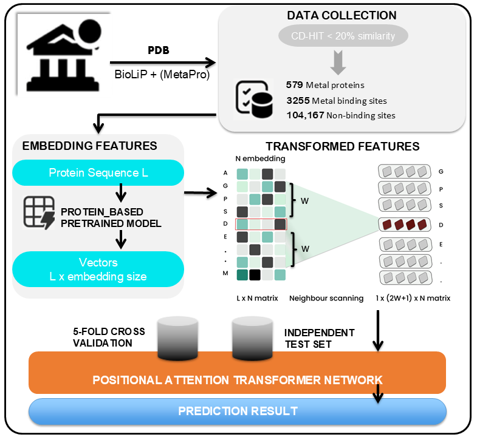

## MetalBind_PATN: Enhancing Metal-Binding Residue Classification Using Protein Language Model Embeddings and Positional Attention Transformer Network
The proposed archtecture, RAG-PLMs-MetalBind, leverages external databases to augment minority (positive) classes feature representation and improve model sensitivity. The Transformer-based PATN model captures both short- and long-range dependencies within sequence data using this strategy. Utilizing a benchmark dataset and comparisons with established baseline methods, our model achieved accuracy of 98.09%, specificity of 98.11%, sensitivity of 97.32%, and an AUC of 99.72%. Notably, RAG-PLMs-MetalBind outperformed the baseline methods in recall (+71%) and MCC (+54%), demonstrating significant improvements in identifying metal-binding residues.
## Fig. 1: Our Comprehensive Research Workflow:


## Quick Start

### Step 1: Generate Data Features
Navigate to the 'data' folder and use the FASTA file to generate additional data features that are saved in the 'dataset' folder..

**Example usage:**

```bash
python get_ProtTrans.py -in "Your FASTA file folder" -out "The destination folder of your output"
python get_tape.py -in "Your FASTA file folder" -out "The destination folder of your output"
python get_esm.py "Pretrained model of ESM" "Your FASTA file folder" "The destination folder of your output" --repr_layers 33 --include per_tok
python get_ProstT5.py -in "Your FASTA file folder" -out "The destination folder of your output"
```
### Step 2: Create a multi-scale or the sliding windows feature set.
1. **Run `get_dataset.py`:**
   - Python get_dataset.py -in "path of features" -label "path of labels" -out "path of output features set" -w 7 -dt ".prottrans" 
     - w is sliding window size; in our case, we use 7
     - The feature type: use `'dt'` for prottrans, `'esm'` for ESM, and `'tape'` for TAPE, etc

2. **Set paths in file `import_test.py`:**
     - `train_data.npy`: Contains the training data.
     - `train_labels.npy`: Contains the corresponding training labels.
     - `testing_data.npy`: Contains the testing data.
     - `testing_labels.npy`: Contains the corresponding testing labels.

### Step 3: RAG Strategy
1. **Create RAG-DB:**
 - Run the `get_dataset_RAG_DB.npy` file to creat RAG-DB or External DataBase.
 - Run the `get_RagEmb_Batch.npy` file to Create the final embeddings.

### Step 4: Execute Prediction
1. **Run the Model:**
   - Open the `DeepAtten_Metal.ipynb` file in Jupyter Notebook.
   - Execute the cells in the notebook to run the model and make predictions based on your Final RAG-Embeddings.

## References
1.	UniProt: the Universal Protein knowledgebase in 2023. Nucleic Acids Research, 2023. 51(D1): p. D523-D531.
2.	Elnaggar, A., et al., ProtTrans: Toward Understanding the Language of Life Through Self-Supervised Learning. IEEE Trans Pattern Anal Mach Intell, 2022. 44(10): p. 7112-7127.
